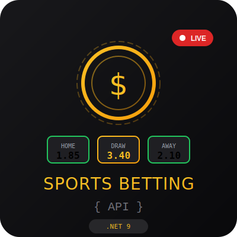
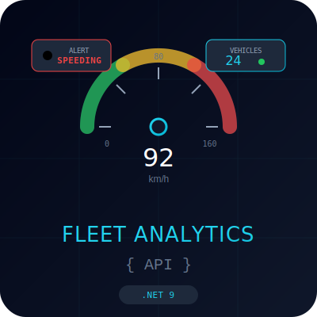
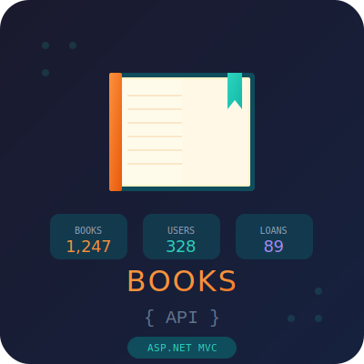

<div align="center">
  <h1>Hey, I'm Daniel Dias!</h1>
  <h3>Software Developer | C# & .NET | Building Real-World APIs</h3>
</div>

---

## About Me
```csharp
var DanielDias = new SoftwareDeveloper
{
    Pronouns = "He | Him",
    Code = new[] { "C#", "T-SQL" },
    Technologies = new 
    {
        Backend = new[] { ".NET", "ASP.NET Core", "EF Core", "REST APIs" },
        Testing = new[] { "xUnit", "TDD" },
        DevOps = new[] { "Docker", "Azure", "CI/CD" },
        Databases = new[] { "SQL Server", "PostgreSQL" }
    },
    Architecture = new[] { "Clean Architecture", "SOLID", "Repository Pattern" },
    CurrentlyLearning = "Microservices and Angular",
    Education = new[] { "Computing at SETU Ireland", "System Analysis at Unifatecie Brazil" },
    Languages = new[] { "Portuguese", "English", "Italian" },
    Hobbies = new[] { "Football", "Gym" },
    Goal = ".NET Developer"
    
};

```

---

## Technologies & Tools


<div align="center">


</div>

---

## Featured Projects

<div align="center">
  <a href="https://github.com/DeVFirmino/SportsBetting">
    
  </a>
  &nbsp;&nbsp;&nbsp;
  <a href="https://github.com/DeVFirmino/FleetAnalytics">
    
  </a>
  &nbsp;&nbsp;&nbsp;
  <a href="https://github.com/DeVFirmino/BookManagment">
    
  </a>
</div>


---

| Project | Description | Tech |
|---------|-------------|------|
| [**Sports Betting API**](https://github.com/DeVFirmino/SportsBetting) | REST API for betting platform with wallet system and real-time odds | .NET 9, Clean Architecture, JWT, EF Core, SQL Server |
| [**Fleet Analytics API**](https://github.com/DeVFirmino/FleetAnalytics) | Vehicle telemetry processing with speeding violation detection | .NET 9, EF Core, SQLite |
| [**Books API**](https://github.com/DeVFirmino/BookManagment) | Library management system with borrowing workflows and Excel reports | .NET 8, ASP.NET Core MVC, EF Core, ClosedXML |

---

## Let's Connect

<div align="center">

[](https://www.linkedin.com/in/daniel-dias-504168113/)
[](mailto:daanspfc@gmail.com)
[](https://github.com/DeVFirmino)

</div>

---

<div align="center">
  <i> Open to new opportunities!</i>
</div>
