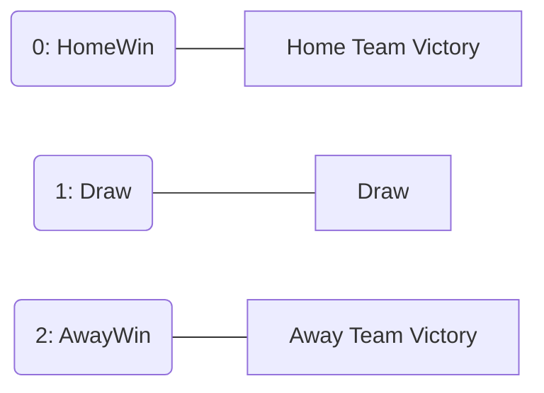

<div align="center">
    


# SportsBetting API
**Sports Betting Platform** built with **.NET 9** and **Clean Architecture** principles,
designed to showcase enterprise level C# development skills for **.NET backend positions**.

## Live Demo
The API is currently live and can be tested via Swagger UI:
[SportsBetting API Online](https://sportsbetting-api.salmonocean-c68fcbc3.eastus2.azurecontainerapps.io/swagger/index.html)

> **Note:** Initial load might take a few seconds due to "Cold Start" (Azure scaling from zero to active).

</div>

## Project Overview

**Educational Project** - Built to demonstrate enterprise .NET development
> skills for backend positions. Not for production use.

Enterprise-grade sports betting platform showcasing **Clean Architecture**,
**Concurrency control**, and **real-time sports data integration** using .NET 9

## Patterns & Principles

- **SOLID Standards:** Dependency Inversion, Interface Segregation, Single Responsibility
- **Separation of Concerns:** DTOs for API contracts, Use Cases for business logic
- **Domain-Driven Design:** Rich domain models with business rule encapsulation
- **Dependency Injection:** Full decoupling of layers via high-level abstractions

**Repository Pattern (Interface Segregation):**
- `IReadOnlyRepository` - Query operations
- `IWriteOnlyRepository` - Insert operations
- `IUpdateOnlyRepository` - Update operations

## Security
- **JWT authentication** with token based authorization
- Password hashing using BCrypt
- **FluentValidation** for input sanitization
- SQL injection prevention via EF Core parameterization

##  Testing
- **xUnit Tests**: Use case logic validation
- **Integration Tests**: User registration and authentication flows
- **Validator Tests**: FluentValidation rules
- **Fluent Assertions**: Readable assertions
- **Moq** - Mocking framework
- **Bogus** - Fake data generation.
- **Test Coverage**: 20% 

### External Services
- **RapidAPI Football API** - Sports data integration

## Features

<table>
<tr>
<td width="50%" valign="top">

### User Management
- **User Registration** with email validation and password hashing.
- **JWT Authentication** with token-based authorization
- **User Profile** management with password change functionality

</td>
<td width="50%" valign="top">

### Wallet System
- **Deposit funds** - **Balance management** with decimal precision (with that I get precise numbers so I used decimal...)
- **Concurrent bet protection** - prevents negative balance from simultaneous bets (with the FluentValidation)

</td>
</tr>
<tr>
<td width="50%" valign="top">

### Betting System
- **Place bets** on upcoming football fixtures
- **Auto-generated event names** from Football API (example: "Manchester United vs Liverpool")
- **Auto-fetched odds** based on bet type (HomeWin, Draw, AwayWin)
- This was for learning purposes so I don't have real odds so I mocked on the API Service.
- **Enum based BetType** for type safety and validation (User can only set **HomeWin, Draw, and AwayWin**)
- **Potential winning calculation** (Amount × Odds) - Note I don't have algorithm for that, it was only simple logic here.
- **Get bet by ID** with detailed information
- **Race condition prevention** (For testing I placed two postman tabs with the same User Authorized Session and Placed bet together and tested with // await Task.Delay(5000); // on my PlaceBetUseCase)
> **Note:** Odds are currently mocked in the Football API service for learning purposes.

</td>
<td width="50%" valign="top">

### Football API Integration
- Integration with **API-FOOTBALL** (RapidApi)
- Get **upcoming fixtures** with odds
- User can bet for **HomeWin, Draw, and AwayWin** betting markets
- Auto-population of event details and odds

</td>
</tr>
</table>

##  Architecture
This project follows **Clean Architecture** with clear separation of concerns:
```text
SportsBetting/
├── src/
│ ├── Backend/
│ │ ├── SportsBetting.API           # Controllers, Filters, Middleware
│ │ ├── SportsBetting.Application   # Use Cases, AutoMapper, Validators
│ │ ├── SportsBetting.Domain        # Entities, Enums, Interfaces
│ │ └── SportsBetting.Infrastructure# EF Core, Repositories, External APIs
│ └── Shared/
│ ├── SportsBetting.Communication   # DTOs (Requests/Responses)
│ └── SportsBetting.Exceptions      # Custom exceptions
└── tests/
├── UseCase.Test                    # Unit tests
├── Validator.Tests                 # FluentValidation tests
├── WebApi.Test                     # Integration tests
└── CommonTestsUtilities            # Test builders
```
```mermaid
erDiagram
Users ||--|| Wallets : "1:1"
Users ||--o{ Bets : "1:N"

    EntityBase {
        bigint Id PK
        bit Active "Default: true"
        datetime2 CreatedOn 
    }

    Users {
        bigint Id PK
        nvarchar Name
        nvarchar Email UK
        nvarchar Password
        bit Active
        datetime2 CreatedOn
    }

    Wallets {
        bigint Id PK
        bigint UserId FK
        decimal Balance
        rowversion RowVersion "Optimistic Concurrency"
    }

    Bets {
        bigint Id PK
        bigint UserId FK
        int FixtureId
        decimal Amount
        decimal Odds
        decimal PotentialWinning
        int BetType
        int Status
        datetime2 PlacedAt
    }
 ```
 
## Concurrency Flow (Wallet Protection)
```mermaid
sequenceDiagram
    participant User
    participant API
    participant Database
    
    User->>API: POST /api/bet (Amount: €100)
    API->>Database: SELECT Balance, RowVersion WHERE UserId = X
    Database-->>API: Balance: €500, RowVersion: 0x001
    
    Note over API: Check: €500 >= €100 ✓
    
    API->>Database: UPDATE Wallets SET Balance = €400WHERE UserId = X AND RowVersion = 0x001
    
    alt RowVersion Matched
        Database-->>API: Success (RowVersion now 0x002)
        API-->>User: 201 Created - Bet Placed
    else RowVersion Changed (Concurrent Bet)
        Database-->>API: 0 rows affected
        API-->>User: 409 Conflict - "Another bet was placed simultaneously"
    end
```  

 

## Enum & Mappings


 

## Tech Stack

- **.NET 9** / **C# 13**
- **ASP.NET Core** - Web API 
- **Entity Framework Core** - ORM with SQL Server
- **SQL Server** - Relational database
- **AutoMapper** - Object-to-object mapping
- **FluentValidation** - Request validation
- **JWT** - Authentication
- **Swagger** - API documentation
- **RapidAPI Football API** - External sports data


## Technical Highlights (Betting - Wallet)

### Optimistic Concurrency Control
Prevents race conditions in wallet operations using **RowVersion**:
```csharp
// Wallet entity with version tracking
public byte[] RowVersion { get; set; } = default!;

// EF Core auto-updates RowVersion on every UPDATE
builder.Property(w => w.RowVersion).IsRowVersion();

// Concurrent update detection
catch (DbUpdateConcurrencyException)
{
    throw new ErrorOnValidationException([ResourcesMessagesException.CONCURRENT_BET_DETECTED]);
}
```

**How it works:**
- SQL Server updates `RowVersion` automatically on each change
- EF Core validates version in `WHERE` clause: `WHERE Id = X AND RowVersion = @value`
- Concurrent updates trigger `DbUpdateConcurrencyException`
- User receives: *"Another bet was placed simultaneously. Please try again."*

**Testing:** Verified with simultaneous Postman requests using the same user session + `Task.Delay(5000)` to simulate race conditions.

**All odds and payouts are **server controlled** - users can only specify `fixtureId`, `amount`, and `betType`.**

## Prerequisites
.NET 9 SDK or later
SQL Server 
RapidAPI Account (for Football API access)
Visual Studio  or JetBrains Rider (I used Rider for development so I suggest the Rider) 
Postman or similar tool for API testing or it can be Swagger for better visulization.


## Setup Instructions
 (Via Docker)
## Docker & Cloud Deployment

This project is fully containerized and engineered to run in scalable cloud environments.

### Local Execution with Docker
Run the API locally without needing the .NET SDK installed:

```bash
# Build the image
docker build -t sportsbetting-api .

# Run the container
docker run -p 8080:8080 sportsbettin       g-api

docker run -p 8080:8080 sportsbetting-api

```


### 1. Clone Repository
```bash
git clone https://github.com/DeVFirmino/SportsBetting.git
cd SportsBetting

```

### 2. Configure Database Connection
Edit `src/Backend/SportsBetting.API/appsettings.Development.json`:
```json
{
  "ConnectionStrings": {
    "DefaultConnection": "Server=(localdb)\\mssqllocaldb;Database=SportsBetting;Trusted_Connection=true;TrustServerCertificate=true"
  }
}
```

### 3. Configure Football API
Get your API key from [RapidAPI](https://rapidapi.com/api-sports/api/api-football) and update `appsettings.Development.json`:
```json
{
  "FootballApi": {
    "BaseUrl": "https://api-football-v1.p.rapidapi.com/v3",
    "ApiKey": "YOUR_RAPIDAPI_KEY_HERE"
  },
  "Jwt": {
    "SigningKey": "your-secret-key-min-32-characters-long",
    "ExpirationMinutes": 60
  }
}
```

### 4. Run Database Migrations
```bash
cd src/Backend/SportsBetting.API

# Apply all migrations
dotnet ef database update
```

**Migrations include:**
- Initial schema (Users, Wallets, Bets)
- RowVersion for Wallet concurrency control
- BetType enum conversion
- FixtureId index on Bets

### 5. Run Application
```bash
dotnet run
```

**URLs:**
- **HTTP**: `http://localhost:5051` *(Recommended)*
- **HTTPS**: `https://localhost:7051`
- **Swagger**: `http://localhost:5051/swagger`
---

## API Endpoints  

### Authentication
| Method | Endpoint | Description | Auth Required |
| :--- | :--- | :--- | :--- |
| POST | `/api/user/register` | Register a new user account | No |
| POST | `/api/user/login` | Authenticate and retrieve JWT token | No |
| GET | `/api/user/profile` | Retrieve the authenticated user profile | Yes |
| PUT | `/api/user/change-password` | Update account password | Yes |

### Wallet Management
| Method | Endpoint | Description | Auth Required |
| :--- | :--- | :--- | :--- |
| POST | `/api/wallet/deposit` | Add funds to the user's wallet | Yes |
| GET | `/api/wallet` | Check current wallet balance | Yes |

### Please add balance before you place a bet in a fixtureId

### Betting Operations
> **Important:** Get a `fixtureId` from `/api/fixture` before placing bets.


| Method | Endpoint | Description | Auth Required |
| :--- | :--- | :--- | :--- |
| POST | `/api/bet` | Place a new bet on a fixture | Yes |
| GET | `/api/bet` | Retrieve all bets placed by the user | Yes |
| GET | `/api/bet/{id}` | Retrieve details of a specific bet | Yes |

### Fixtures and Odds
| Method | Endpoint | Description | Auth Required |
| :--- | :--- | :--- | :--- |
| GET | `/api/fixture` | Get upcoming matches and  odds | Yes |

##  API Bet Documentation

### Authentication Endpoints

**Once registered please place the JWT token on Swagger Authorize Session:
Example: Bearer eyJhbGciOiJIUzI1NiIsInR5cCI6Ik.....**


**Register User**
```http
POST /api/user/register
Content-Type: application/json

{
  "name": "Cristiano Ronaldo",
  "email": "cr7@portugal.com",
  "password": "SiuuuCR7!"
}
```

**Login**
```http
POST /api/user/login
Content-Type: application/json

{
  "email": "cr7@portugal.com",
  "password": "SiuuuCR7!"
}
```

### Wallet Endpoints

**Deposit Funds**
```http
POST /api/wallet/deposit
Authorization: Bearer {jwt_token}

{ "amount": 959.00 }
```

**Get Balance**
```http
GET /api/wallet
Authorization: Bearer {jwt_token}
```

### Betting Endpoints

**Get Fixtures**
```http
GET /api/fixture
Authorization: Bearer {jwt_token}
```

**Place Bet**
```http
POST /api/bet
Authorization: Bearer {jwt_token}

{
  "fixtureId": 12345,
  "amount": 70.00,
  "betType": "HomeWin"  // Options: HomeWin, Draw, AwayWin
}
```

**Get User Bets**
```http
GET /api/bet
Authorization: Bearer {jwt_token}
```

**Get Bet by ID**
```http
GET /api/bet/{id}
Authorization: Bearer {jwt_token}
```

### Quick Start Workflow

1. **Register** → Receive JWT token
2. **Deposit funds** → Add balance to wallet
3. **Get fixtures** → View available matches with odds
4. **Place bet** → Select fixture, amount, and bet type
 

### Error Codes

- `400` - Validation error or insufficient balance
- `401` - Unauthorized (invalid/missing token)
- `404` - Resource not found
- `409` - Concurrent bet conflict

---

## Author

<table>
  <tr>
    <td align="center">
      <a href="https://github.com/DeVFirmino">
        <br>
         <sub>
          <b>Daniel Dias</b>
        </sub>
      </a>
    </td>
    <td>
      <p><strong>Daniel Dias</strong> </p>
      <p>Backend developer C# and .NET with a focus on building real-world APIs</p>
      <p>
        <a href="https://www.linkedin.com/in/daniel-dias-504168113/">
          
        </a>
        <a href="https://github.com/DeVFirmino">
          
        </a>
        <a href="mailto:daanspfc@gmail.com">
          
        </a>
      </p>
    </td>
  </tr>
</table>

<div align="center"> <strong>
Developed for practice & portfolio purposes</strong>
<i>Not for commercial use</i> </div>
 


