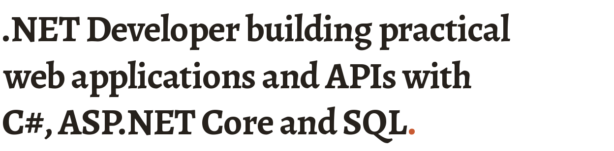
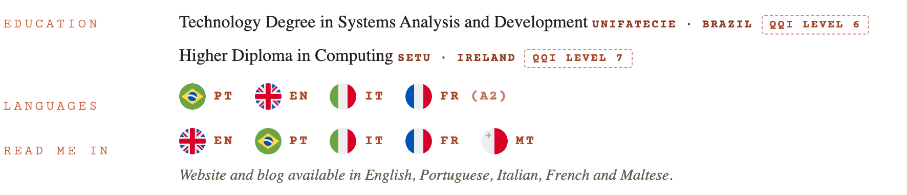
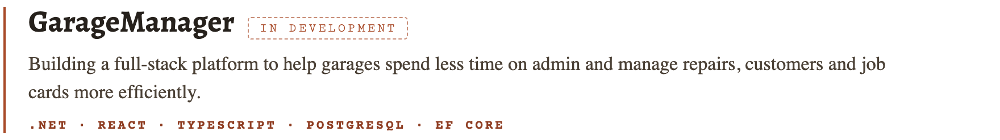

<picture>
  <source media="(prefers-color-scheme: dark)" srcset="assets/wordmark-dark.png">
  
</picture>

[**Website**](https://danieldias.dev/en) · [**Blog**](https://danieldias.dev/en/blog) · [**LinkedIn**](https://www.linkedin.com/in/daniel-dias-504168113/) · [**Email**](mailto:daanspfc@gmail.com)

<picture>
  <source media="(prefers-color-scheme: dark)" srcset="assets/lead-dark.png">
  
</picture>

<picture>
  <source media="(prefers-color-scheme: dark)" srcset="assets/credentials-dark.png">
  
</picture>

## Tech

**Backend**

**Frontend**

**Data**

**Cloud**

**Learning**

## Projects

<picture>
  <source media="(prefers-color-scheme: dark)" srcset="assets/card-maltese-dark.png">
  
</picture>

[**Open live site ↗**](https://maltesetranscriber.mt) · Source private

<picture>
  <source media="(prefers-color-scheme: dark)" srcset="assets/card-garage-dark.png">
  
</picture>

Source private

### The build log

[**PayMaestro**](https://github.com/DeVFirmino/PayMaestro) 
A payment orchestration case study built to explore reliable payment processing, gateway failover and protection against duplicate charges. 
.NET · ASP.NET CORE · EF CORE · SQL

[**Sports Betting API**](https://github.com/DeVFirmino/SportsBetting) 
A backend betting platform with wallets, markets and bet settlement, built around safe balance handling and concurrent transactions. [Live API ↗](https://sportsbetting-api.salmonocean-c68fcbc3.eastus2.azurecontainerapps.io/swagger/index.html) 
.NET · ASP.NET CORE · SQL · AZURE

[**URL Shortener**](https://github.com/DeVFirmino/UrlShortner) 
A distributed URL shortening service built to handle fast redirects, caching and horizontal scaling across multiple API instances. 
.NET · REDIS · CASSANDRA · DOCKER

The Sports Betting demo scales to zero, so the first request can take around 15 seconds. It is fast after that.

<b>Five more projects</b>

 

[**daniel dias**](https://danieldias.dev/en) 
The portfolio you're browsing now — built to bring my projects, technical articles and work as a .NET developer into one place. 
.NET · RAZOR PAGES · MARKDOWN · DOCKER

[**Good Hamburger**](https://github.com/DeVFirmino/good-hamburger) 
Order management API with combo discount rules, domain-level category invariants, structured error handling and integration tests. 
.NET · ASP.NET CORE · EF CORE · XUNIT

[**Book Management**](https://github.com/DeVFirmino/BookManagment) 
ASP.NET Core MVC library application with borrowing workflows, inventory management and reporting. 
.NET · ASP.NET CORE MVC · EF CORE · SQL

[**Portfolio Manager**](https://github.com/DeVFirmino/AvaloniaPortifolioManager) 
Desktop app for browsing clients, investment portfolios, holdings and transactions — built with Avalonia (a cross-platform take on WinForms/WPF) and EF Core. 
.NET · AVALONIA · EF CORE · SQL

[**Transaction Management**](https://github.com/DeVFirmino/TransactionManagment) 
Financial goals API with deposits and withdrawals, overdraft protection and decimal-safe EF Core persistence. 
.NET · ASP.NET CORE · EF CORE · SQL

## Writing

[**AZ-900 Study Guide**](https://github.com/DeVFirmino/AZ900-Studies) — a practical Azure Fundamentals study guide focused on understanding the concepts behind the exam, not just memorising answers.

[**Blog**](https://danieldias.dev/en/blog) — I share ideas and articles on .NET, Azure and system design, available in English, Portuguese, Italian, French and Maltese.

## Say hello

<picture>
  <source media="(prefers-color-scheme: dark)" srcset="assets/open-to-work-dark.png">
  
</picture>

