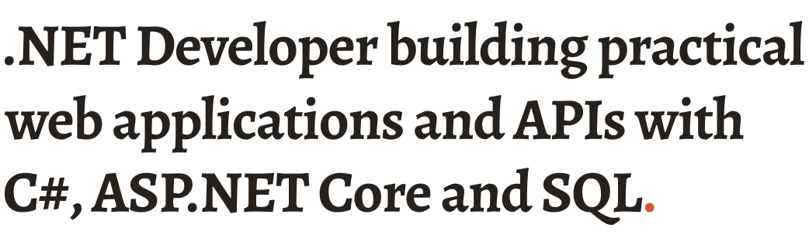
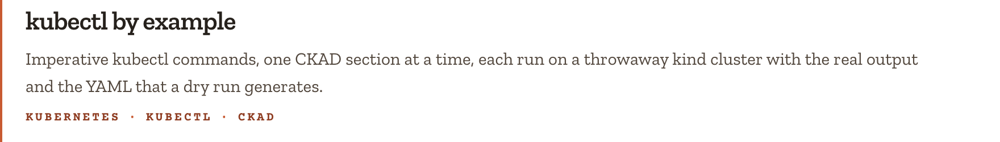
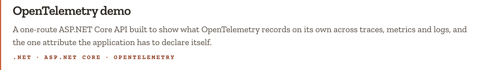
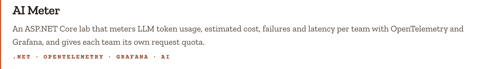

<picture>
  <source media="(prefers-color-scheme: dark)" srcset="assets/logo-dark.svg">
  
</picture>

[**Website**](https://danieldias.dev/en) · [**Blog**](https://danieldias.dev/en/blog) · [**LinkedIn**](https://www.linkedin.com/in/daniel-dias-504168113/) · [**Email**](mailto:daanspfc@gmail.com)

<picture>
  <source media="(prefers-color-scheme: dark)" srcset="assets/lead-dark.svg">
  
</picture>

<picture>
  <source media="(prefers-color-scheme: dark)" srcset="assets/credentials-dark.png">
  
</picture>

## Tech

**Backend**

**Frontend**

**Data**

**Cloud & CI**

## Projects

<picture>
  <source media="(prefers-color-scheme: dark)" srcset="assets/card-maltese-dark.png">
  
</picture>

[**Open live site ↗**](https://maltesetranscriber.mt) · Source private

[**PayMaestro**](https://github.com/DeVFirmino/PayMaestro) 
Payment orchestration with decline-aware gateway cascades, completed-outcome replay, fraud screening and audit trails. 
.NET · ASP.NET CORE · EF CORE · SQL

[**Sports Betting API**](https://github.com/DeVFirmino/SportsBetting) 
Wallets, markets and idempotent bet placement, with odds and potential winnings kept under server control and SQL Server integration tests in CI. [Live API ↗](https://sportsbetting-api.salmonocean-c68fcbc3.eastus2.azurecontainerapps.io/swagger/index.html) 
.NET · ASP.NET CORE · SQL SERVER · AZURE — demo scales to zero, so the first request takes ~15s

[**URL Shortener**](https://github.com/DeVFirmino/UrlShortner) 
Distributed shortening service built for fast redirects, caching and horizontal scaling across multiple API instances. 
.NET · REDIS · CASSANDRA · DOCKER

<b>Five more projects</b>

 

[**daniel dias**](https://danieldias.dev/en) — the portfolio you're browsing now: projects, technical articles and my work as a .NET developer in one place. 
.NET · RAZOR PAGES · MARKDOWN · DOCKER

[**Good Hamburger**](https://github.com/DeVFirmino/good-hamburger) — order management API with combo discount rules, domain-level invariants and integration tests. 
.NET · ASP.NET CORE · EF CORE · XUNIT

[**Book Management**](https://github.com/DeVFirmino/BookManagment) — MVC library lending app whose admin area sits behind an action filter tested for admin, non-admin and anonymous access. 
.NET · ASP.NET CORE MVC · EF CORE · SQL

[**Portfolio Manager**](https://github.com/DeVFirmino/AvaloniaPortifolioManager) — desktop app for clients, investment portfolios, holdings and transactions, built with Avalonia and EF Core. 
.NET · AVALONIA · EF CORE · SQL

[**Fleet Analytics**](https://github.com/DeVFirmino/FleetAnalytics) — vehicle telemetry API that computes trip distance from GPS readings and writes each trip log with its speeding or maintenance alert in one atomic transaction. 
.NET · ASP.NET CORE · EF CORE · XUNIT

## Writing

<a href="https://github.com/DeVFirmino/kubectl-by-example">
  <picture>
    <source media="(prefers-color-scheme: dark)" srcset="assets/card-kubectl-dark.png">
    
  </picture>
</a>

<a href="https://github.com/DeVFirmino/dotnet-opentelemetry-search">
  <picture>
    <source media="(prefers-color-scheme: dark)" srcset="assets/card-otel-dark.png">
    
  </picture>
</a>

<a href="https://github.com/DeVFirmino/ai-meter">
  <picture>
    <source media="(prefers-color-scheme: dark)" srcset="assets/card-ai-meter-dark.png">
    
  </picture>
</a>

[**AZ-900 Study Guide**](https://github.com/DeVFirmino/AZ900-Studies) — Azure Fundamentals from the concepts up, not memorised answers.

[**Blog**](https://danieldias.dev/en/blog) — .NET, Azure and system design, in English, Portuguese, Italian, French and Maltese.

## Say hello

I'm open to backend .NET roles and freelance projects involving APIs and integrations.

<picture>
  <source media="(prefers-color-scheme: dark)" srcset="assets/open-to-work-dark.png">
  
</picture>

